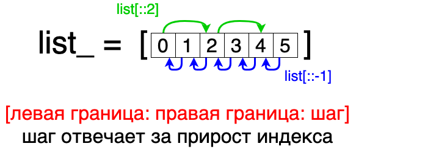

# Слайсирование в Python

## Цель урока
Научитесь использовать слайсирование в языке программирования Python для получения подмножества элементов из коллекций.  
Вы узнаете, как задавать индексы и шаг слайсирования, а также как использовать слайсирование для разворота коллекций.

## Теория
Слайсирование (slicing) позволяет получить подмножество элементов из коллекций, таких как строки, списки и кортежи, используя индексы.  
Синтаксис слайсирования имеет вид: `[start:stop:step]`.

При использовании слайсирования учитывайте следующие особенности:

- Если вы не указываете шаг слайсирования `step`, то он по умолчанию равен 1.
- Левый индекс `start` слайсирования включается в результат, а правый индекс `stop` исключается.  
  Например, `[1:5]` включает элементы с индексами от 1 до 4, но не включает элемент с индексом 5.
- Если вы опускаете левый индекс `start`, слайсирование начинается с первого элемента коллекции.  
  Например, `my_list[:3]` вернет первые три элемента списка.
- Если вы опускаете правый индекс `stop`, слайсирование продолжается до последнего элемента коллекции.  
  Например, `my_list[2:]` вернет все элементы списка, начиная с индекса 2 и до конца.
- Слайсирование всегда возвращает копию коллекции.

### Примеры использования слайсирования:
Слайсирование строки:
```python
my_string = "Hello, World!"
substring = my_string[7:12]
print(substring)  # Вывод: "World"
```

Слайсирование списка:
```python
my_list = [1, 2, 3, 4, 5]
sublist = my_list[1:4]

print(sublist)  # Вывод: [2, 3, 4]
```

Опускание индексов:
```python
my_list = [1, 2, 3, 4, 5]
skip_first = my_list[1:]  # всё кроме первого элемента
skip_last = my_list[:-1]  # всё кроме последнего элемента
skip_both = my_list[:]  # копия исходного списка

print(skip_first)  # Вывод: [2, 3, 4, 5]
print(skip_last)  # Вывод: [1, 2, 3, 4]
print(skip_both)  # Вывод: [1, 2, 3, 4, 5]
```

### Шаг слайсирования
Вы также можете использовать шаг слайсирования, чтобы получить элементы с определенным шагом


```python
list_ = [0, 1, 2, 3, 4, 5]
step_slice = list_[::2]  # элементы стоящие на четных индексах

print(step_slice)  # Вывод: [0, 2, 4]
```

Используя отрицательный шаг, можно перевернуть коллекцию:
```python
list_ = [0, 1, 2, 3, 4, 5]
reversed_list = list_[::-1]
print(reversed_list)  # [5, 4, 3, 2, 1, 0]
```

## Задание: Разворот слова
### Описание
У вас есть слово, но вам нужно получить его задом наперёд.  
Ваша задача — использовать слайсирование для разворота слова "телефон".

### Задача
1. Используя слайсирование, получите развернутое слово `word`.
